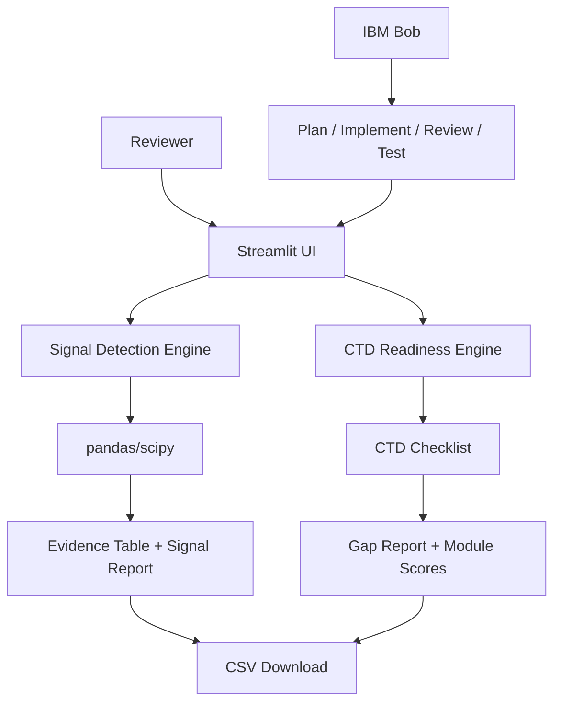

# Architecture

## Components

| Component | Technology | Responsibility |
|---|---|---|
| UI | Streamlit | Inputs, controls, tables, downloads |
| Signal engine | Python + pandas + scipy | 2x2 tables, PRR, chi-square, triage |
| CTD engine | Python | Module/section normalization and completeness |
| Data | CSV/JSON | Reproducible demo inputs |
| Engineering agent | IBM Bob | Planning, implementation, code review and terminal testing |

## End-to-end data flow
The reviewer uploads or selects data in the UI. The relevant deterministic engine processes the records and returns evidence tables. No real patient identifiers are required for the demo.

## Security notes
- Never commit `.env` or credentials.
- Use synthetic/de-identified demo data.
- Production deployment should add authentication, encryption, audit logging, role-based access, data retention controls, and validated GxP processes.

## Scalability
For a prototype, pandas is sufficient. A production version could move aggregation to a database/data warehouse and run batch or streaming calculations while preserving the same evidence schema.
